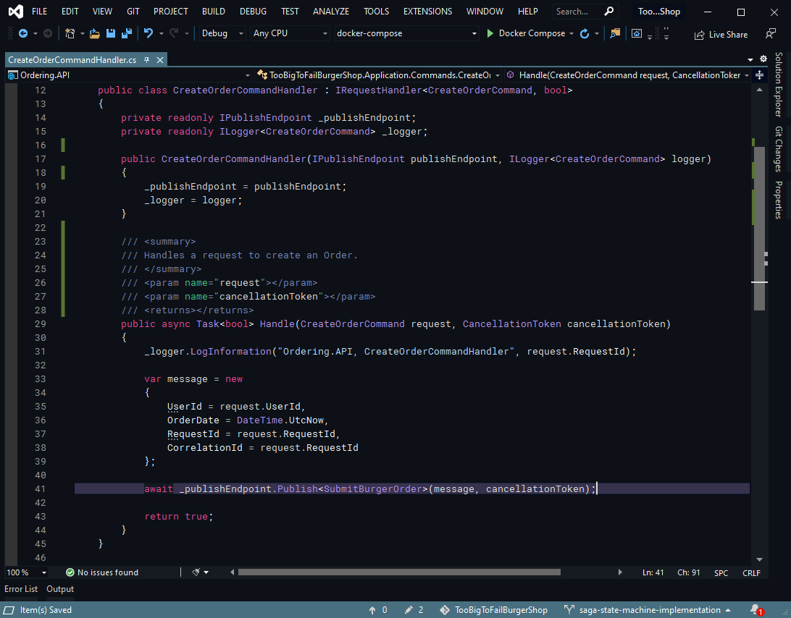

 
# DankVaporwave theme
> A vaporwave inspired color theme for Visual Studio 2019

## Install
Available on the [Visual Studio Marketplace](https://marketplace.visualstudio.com/items?itemName=JBW.DankVaporwave).

## Color Palette

| Palette            | Color                                                                     |
|--------------------|---------------------------------------------------------------------------|
| Foreground         | 

 |
| Background         | 

 |
| Comment            | 

 |
| Types              | 

 |
| Keywords           | 

 |
| Selected line mask | 

 |
| String             | 

 |

## License
[MIT License](./LICENSE.txt)
